<!-- hero: monochrome ASCII art beside a neofetch-style info panel.
     regenerate art: python scripts/prep_photo.py <image> (real photos;
     use prep_photo_flat.py for flat/illustrated art) && python scripts/make_ascii_svg.py ;
     info panel: python scripts/make_info_card.py -->
<table>
<tr>
<td valign="top"></td>
<td valign="top"></td>
</tr>
</table>

## hoophedge

**Automated Trading Signals · Portfolio Tracking · Market Automation**

 

<!-- animated contribution graph: real data, boxes reveal cell by cell
     (regenerated daily by .github/workflows/update-profile-art.yml) -->

